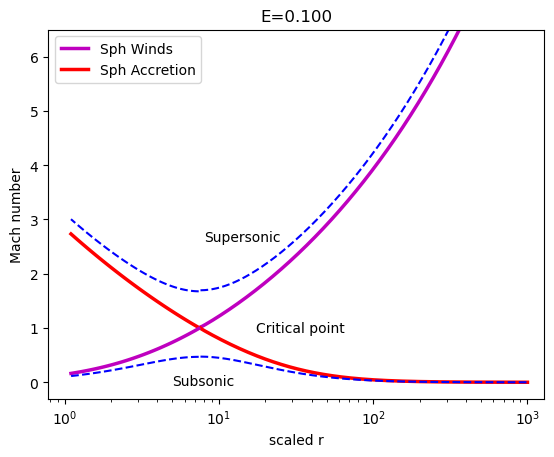
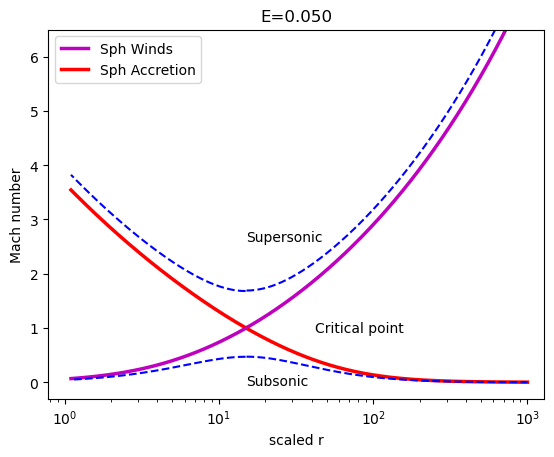
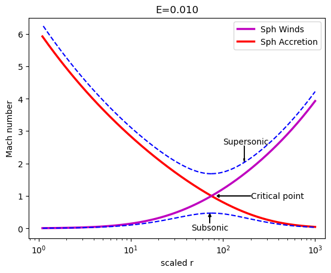
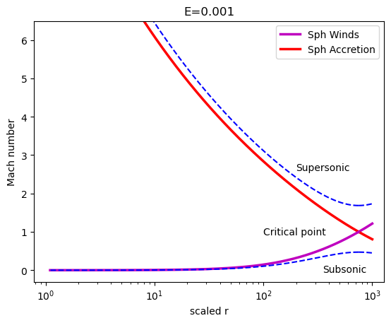

# Astrophysics

## 1. Spherical Accretion: Bondi Flow

This is an application of fluid dynamics in astrophysics. First modeled by Hermann Bondi (1952), this model describes accretion onto spherical isolated compact objects in the interstellar medium. We mostly deal with ideal fluids in this scenario.

To know more about the underlying theory of this accretion model, read my [dissertation](https://drive.google.com/file/d/1L3fMdmTaXKchnCuUwuJwOysXASNPeJ9L/view). 

### Plotting

A phase space plot is a plot describing the variation of momentum (or the velocity) with the spatial coordinate. The phase space trajectory represents the set of states compatible with a particular initial condition. 
Following are the solutions obtained on solving the Bondi equation for polytropic index $n = 3$, and adiabatic index $\gamma = 5/3$. The scaled radial coordinate has been taken in the logarithmic scale and $M$ has been plotted as a function of this scaled $r$. 

### Results

  &nbsp;&nbsp;&nbsp; 

  &nbsp;&nbsp;&nbsp; 

1. The solid lines show physically realistic transonic flows which extend from the surface of the star to infinity. The curves are plotted for a constant accretion rate $\dot{\mathcal{M}}$.
2. The orange solid line represents the Bondi accretion flow. It implies that the velocity $v$ is subsonic at infinity and supersonic on the surface of the star.
3. The point of transition from subsonic to supersonic, that is, the critical point has been marked. We can see that at this point the Mach number is unity.
4. The purple solid line is the corresponding wind solution, for which $v$ is supersonic at infinity and subsonic at the star’s surface.
5. The lower curve is subsonic everywhere and the upper one is supersonic everywhere.
